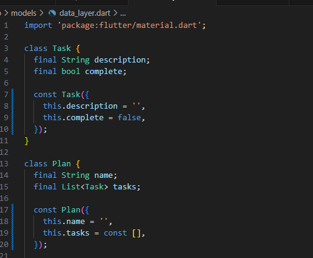
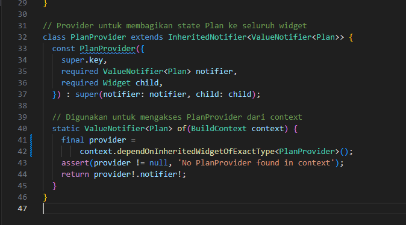
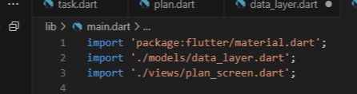
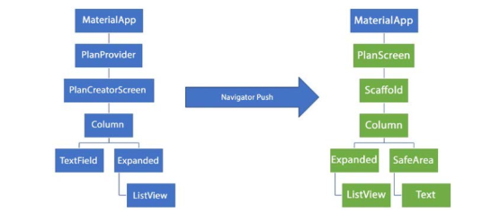
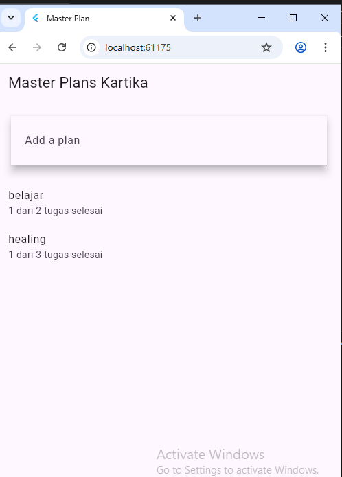
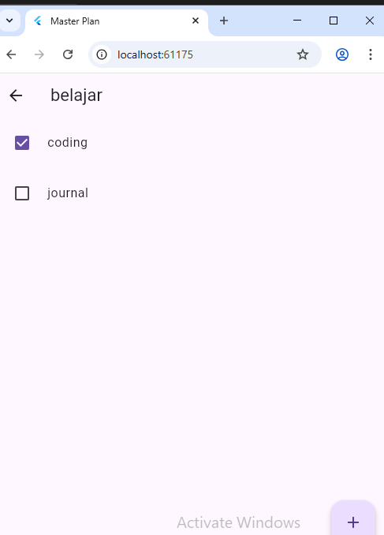

# Praktikum Flutter — Dasar State Management

**Mata Kuliah:** Pemrograman Mobile  
**Nama:** Kartika Tri Juliana  
**NIM:** 2341760116  
**Kelas:** SIB 3C  
**No Absen:** 19  

**Repository:** [Master_plan](https://github.com/kartika3juli15/master_plan.git)

---

## Praktikum 1: Dasar State dengan Model-View

### Langkah-langkah Praktikum  

1. **Langkah 1:** Buat project baru `master_plan`  
   

2. **Langkah 2:** Membuat model `task.dart`  
   

3. **Langkah 3:** Buat file `plan.dart`  
   

4. **Langkah 4:** Buat file `data_layer.dart`  
   

5. **Langkah 5:** Pindah ke file `main.dart`  
   

6. **Langkah 6:** Buat file `plan_screen.dart`  
   

7. **Langkah 7:** Buat method `_buildAddTaskButton`  
   

8. **Langkah 8:** Buat widget `_buildList()`  
   

9. **Langkah 9:** Buat widget `_buildTaskTile`  
   

10. **Langkah 10:** Tambahkan *Scroll Controller*  
    

11. **Langkah 11:** Tambahkan *Scroll Listener*  
    

12. **Langkah 12:** Tambahkan *Controller* dan *Keyboard Behavior*  
    

13. **Langkah 13:** Tambahkan method `dispose()`  
    

14. **Langkah 14:** Hasil akhir  
    

---

## 🧠 Tugas 1  

1. Kerjakan seluruh langkah praktikum kemudian dokumentasikan hasil akhirnya dalam bentuk GIF beserta penjelasan** pada file `README.md`. Jika terdapat error, perbaiki hingga program berjalan dengan baik.  

2. Jelaskan maksud dari langkah 4! Mengapa file `data_layer.dart` dibuat dan apa fungsinya?  
= File data_layer.dart dibuat sebagai file penghubung (barrel file) yang meng-export beberapa model (plan.dart dan task.dart) supaya saat file lain membutuhkan model tersebut, cukup mengimpor satu file saja

3. Jelaskan tujuan variabel `plan` pada langkah 6! Mengapa variabel tersebut dibuat sebagai konstanta?  
= Variabel plan digunakan untuk menyimpan data rencana yang akan ditampilkan pada PlanScreen. Variabel tersebut dibuat sebagai const karena datanya tidak berubah, sehingga lebih efisien dan menghemat memori.

4. Lakukan *capture* hasil langkah 9 dalam bentuk GIF! Jelaskan fungsi widget `_buildTaskTile` dan bagaimana hasilnya bekerja. 
= pada hasil nya adalah memunculkan task dimana, jika task tersebut tercentang maka muncul task telah selesai dari beberapa task

5. Apa kegunaan method pada langkah 11 dan 13 dalam lifecycle state? Jelaskan fungsi dari *Scroll Listener* dan `dispose()` dalam pengelolaan *Stateful Widget*.  
= Langkah 11 (Scroll Listener – initState())
Digunakan untuk menjalankan kode saat widget pertama kali dibuat. Scroll Listener berfungsi memantau pergerakan scroll dan menjalankan aksi tertentu setiap kali user melakukan scroll.

Langkah 13 (dispose())
Dipanggil ketika widget dihapus dari layar. Fungsi dispose() digunakan untuk membersihkan resource seperti scrollController agar tidak terjadi kebocoran memori (memory leak).

6. Kumpulkan laporan praktikum dalam bentuk link commit atau repository GitHub ke dosen sesuai ketentuan.  

---

## Praktikum 2: Mengelola Data Layer dengan InheritedWidget dan InheritedNotifier

### Langkah-langkah Praktikum  

1. **Langkah 1:** Buat file `plan_provider.dart`
   

2. **Langkah 2:** Edit `main.dart`  
   

3. **Langkah 3:** Tambah method pada model `plan.dart`  
   

4. **Langkah 4:** Pindah ke PlanScreen

5. **Langkah 5:** Edit method `_buildAddTaskButton`
   

6. **Langkah 6:** Edit method `_buildTaskTile`

7. **Langkah 7:** Edit `_buildList`  

8. **Langkah 8:** Tetap di class PlanScreen 

9. **Langkah 9:** Tambah widget SafeArea  

10. **Langkah 10:** Hasil akhir  
    

## 🧠 Tugas 2 

1. Kerjakan seluruh langkah praktikum kemudian dokumentasikan hasil akhirnya dalam bentuk GIF beserta penjelasan** pada file `README.md`. Jika terdapat error, perbaiki hingga program berjalan dengan baik.  
= pada hasil akhir terjadi error dan perlu dilakukan perbaikan
perbaikan 1 : tambahkan kode ini pada `data_layer.dart`

perbaikan 2 : kemudian inisiasikan import pada main `plan_screen.dart`

2. Jelaskan mana yang dimaksud `InheritedWidget` pada langkah 1 tersebut! Mengapa yang digunakan `InheritedNotifier`?  
= InheritedNotifier dipilih karena dapat mengirimkan data sekaligus pemberitahuan perubahan ke widget lain secara otomatis, tanpa perlu setState(). Cocok untuk kasus seperti Plan Provider yang datanya bisa berubah dan perlu di-update ke UI.

3. Jelaskan maksud dari method di langkah 3 pada praktikum tersebut! Mengapa dilakukan demikian?
= Data kemajuan (progress) dari suatu plan bisa dihitung dan ditampilkan dengan mudah tanpa perlu menulis logika berulang di bagian lain (seperti UI). Plan menjadi model yang lebih informatif dan mandiri, karena tidak hanya menyimpan data tugas, tetapi juga bisa menghitung status penyelesaiannya

4. Lakukan capture hasil dari Langkah 9 berupa GIF, kemudian jelaskan apa yang telah Anda buat!

5. Kumpulkan laporan praktikum Anda berupa link commit atau repository GitHub ke dosen yang telah disepakati ! 

---
 
## Praktikum 3: Membuat State di Multiple Screens

### Langkah-langkah Praktikum  

1. **Langkah 1:** Edit PlanProvider

2. **Langkah 2:** Edit main.dart

3. **Langkah 3:** Edit plan_screen.dart

4. **Langkah 4:** Error

5. **Langkah 5:** Tambah getter Plan

6. **Langkah 6:** Method initState()

7. **Langkah 7:** Widget build

8. **Langkah 8:** Edit _buildTaskTile

9. **Langkah 9:** Buat screen baru

10. **Langkah 10:** Pindah ke class _PlanCreatorScreenState

11. **Langkah 11:** Pindah ke method build

12. **Langkah 12:** Buat widget _buildListCreator

13. **Langkah 13:** Buat void addPlan()

14. **Langkah 14:** Buat widget _buildMasterPlans()

## 🧠 Tugas 3 

1. Selesaikan langkah-langkah praktikum tersebut, lalu dokumentasikan berupa GIF hasil akhir praktikum beserta penjelasannya di file README.md! Jika Anda menemukan ada yang error atau tidak berjalan dengan baik, silakan diperbaiki sesuai dengan tujuan aplikasi tersebut dibuat.  

2. Berdasarkan Praktikum 3 yang telah Anda lakukan, jelaskan maksud dari gambar diagram berikut ini!
= Gambar diagram tersebut menunjukkan perpindahan halaman (navigasi) dalam aplikasi Flutter menggunakan Navigator.push.
- Bagian kiri (biru) menggambarkan halaman awal, yaitu PlanCreatorScreen, tempat pengguna membuat rencana (input melalui TextField, lalu daftar ditampilkan di ListView).
- Bagian kanan (hijau) menunjukkan halaman tujuan, yaitu PlanScreen, yang muncul setelah pengguna menekan tombol dan aplikasi memanggil Navigator.push.

Pada halaman baru (PlanScreen):
- Menggunakan Scaffold sebagai struktur utama
- Menampilkan daftar tugas (ListView) di dalam Expanded
- teks ringkasan kemajuan di dalam SafeArea.

secara keseluruhan diagram ini menjelaskan alur navigasi dari layar pembuatan rencana ke layar tampilan rencana menggunakan Navigator.push, yang mengganti widget tree dari struktur PlanCreatorScreen ke PlanScreen.

3. Lakukan capture hasil dari Langkah 14 berupa GIF, kemudian jelaskan apa yang telah Anda buat!
= pada gambar pertama menunjukkan pembuatan plan yang dilakukan secara keseluruhan

pada gambar kedua adalah komponen atau tahapan pada plan yang dibuat sebelumnya

4. Kumpulkan laporan praktikum Anda berupa link commit atau repository GitHub ke dosen yang telah disepakati !  
