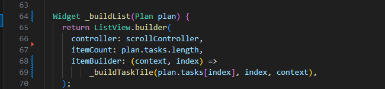

# Praktikum Flutter — Hello World & Widget Dasar  

**Mata Kuliah:** Pemrograman Mobile  
**Nama:** Kartika Tri Juliana  
**NIM:** 2341760116  
**Kelas:** SIB 3C  
**No Absen:** 19  

**Repository:** [Master_plan](https://github.com/kartika3juli15/master_plan.git)

---

## Praktikum 1: Dasar State dengan Model-View

### Langkah-langkah Praktikum  

1. **Langkah 1:** Buat project baru `master_plan`  
   

2. **Langkah 2:** Membuat model `task.dart`  
   

3. **Langkah 3:** Buat file `plan.dart`  
   

4. **Langkah 4:** Buat file `data_layer.dart`  
   

5. **Langkah 5:** Pindah ke file `main.dart`  
   

6. **Langkah 6:** Buat file `plan_screen.dart`  
   

7. **Langkah 7:** Buat method `_buildAddTaskButton`  
   

8. **Langkah 8:** Buat widget `_buildList()`  
   

9. **Langkah 9:** Buat widget `_buildTaskTile`  
   

10. **Langkah 10:** Tambahkan *Scroll Controller*  
    

11. **Langkah 11:** Tambahkan *Scroll Listener*  
    

12. **Langkah 12:** Tambahkan *Controller* dan *Keyboard Behavior*  
    

13. **Langkah 13:** Tambahkan method `dispose()`  
    

14. **Langkah 14:** Hasil akhir  
    

---

## 🧠 Tugas 1  

1. Kerjakan seluruh langkah praktikum kemudian dokumentasikan hasil akhirnya dalam bentuk GIF beserta penjelasan** pada file `README.md`. Jika terdapat error, perbaiki hingga program berjalan dengan baik.  

2. Jelaskan maksud dari langkah 4! Mengapa file `data_layer.dart` dibuat dan apa fungsinya?  

3. Jelaskan tujuan variabel `plan` pada langkah 6! Mengapa variabel tersebut dibuat sebagai konstanta?  

4. Lakukan *capture* hasil langkah 9 dalam bentuk GIF! Jelaskan fungsi widget `_buildTaskTile` dan bagaimana hasilnya bekerja.  

5. Apa kegunaan method pada langkah 11 dan 13 dalam lifecycle state? Jelaskan fungsi dari *Scroll Listener* dan `dispose()` dalam pengelolaan *Stateful Widget*.  

6. Kumpulkan laporan praktikum dalam bentuk link commit atau repository GitHub ke dosen sesuai ketentuan.  

---

## Praktikum 2: Mengelola Data Layer dengan InheritedWidget dan InheritedNotifier

### Langkah-langkah Praktikum  

1. **Langkah 1:** Buat file `plan_provider.dart`
   

2. **Langkah 2:** Edit `main.dart`  
   

3. **Langkah 3:** Tambah method pada model `plan.dart`  
   

4. **Langkah 4:** Pindah ke PlanScreen

5. **Langkah 5:** Edit method `_buildAddTaskButton`
   

6. **Langkah 6:** Edit method `_buildTaskTile`

7. **Langkah 7:** Edit `_buildList`  

8. **Langkah 8:** Tetap di class PlanScreen 

9. **Langkah 9:** Tambah widget SafeArea  

10. **Langkah 10:** Hasil akhir  
    

## 🧠 Tugas 2 

1. Kerjakan seluruh langkah praktikum kemudian dokumentasikan hasil akhirnya dalam bentuk GIF beserta penjelasan** pada file `README.md`.  
   Jika terdapat error, perbaiki hingga program berjalan dengan baik.  

2. Jelaskan mana yang dimaksud `InheritedWidget` pada langkah 1 tersebut! Mengapa yang digunakan `InheritedNotifier`?  

3. Jelaskan maksud dari method di langkah 3 pada praktikum tersebut! Mengapa dilakukan demikian?

4. Lakukan capture hasil dari Langkah 9 berupa GIF, kemudian jelaskan apa yang telah Anda buat!

5. Kumpulkan laporan praktikum Anda berupa link commit atau repository GitHub ke dosen yang telah disepakati ! 

---
 
